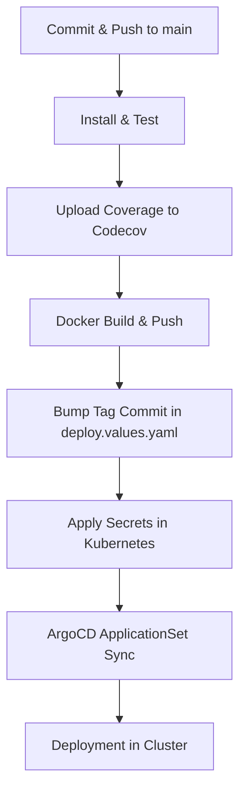

# 📦 pedidos

Simple **Node.js** project created as a base for testing and demonstrating a complete CI/CD pipeline.
This repository includes a minimal HTTP server, a **Woodpecker CI** configuration, and an **ArgoCD ApplicationSet** deployment manifest.

---

## 🚀 Technologies

* **Node.js** (minimal API with `/health` endpoint)
* **Woodpecker CI** (build, tests, Docker build & push, secrets management)
* **Docker Hub** (image registry)
* **ArgoCD + ApplicationSet** (automated deployment to Kubernetes)
* **Traefik** (Ingress Controller)
* **Codecov** (test coverage reports)

---

## 📂 Project Structure

* `index.js` → Simple HTTP server with `/health` route.
* `.woodpecker.yml` → CI/CD pipeline definition for Woodpecker.
* `deploy.values.yaml` → Values used by **ArgoCD ApplicationSet** for deployment.

---

## 🧩 CI/CD Pipeline Overview

The pipeline is triggered on push to the `main` branch:

1. **Install & Test**

   * Runs `npm ci` to install dependencies
   * Runs `npm run test -- --coverage`

2. **Upload Coverage**

   * Uploads coverage report to **Codecov**
   * Requires secret `CODECOV_TOKEN`

3. **Docker Build & Push**

   * Builds Docker image tagged with:

     * `latest`
     * `${CI_COMMIT_SHA}`
   * Pushes both tags to Docker Hub: `wellrcosta/pedidos`
   * Requires secrets: `DOCKER_USER`, `DOCKER_TOKEN`

4. **Bump Tag Commit**

   * Updates `deploy.values.yaml` with new commit SHA
   * Commits and pushes changes back to `main`
   * Requires secret `GITHUB_TOKEN` (PAT with `repo` scope)

5. **Apply Secrets**

   * Creates/updates secrets in Kubernetes
   * Creates `registry-cred` secret for Docker registry access
   * Creates app secret (`pedidos-secrets`) from `ENV_VARS`
   * Requires secrets: `KUBE_CONFIG`, `ENV_VARS`, and optionally Docker credentials

---

## 🔑 Required Secrets in Woodpecker

| Secret          | Description                                            |
| --------------- | ------------------------------------------------------ |
| `CODECOV_TOKEN` | Token for Codecov uploads                              |
| `DOCKER_USER`   | Docker Hub username                                    |
| `DOCKER_TOKEN`  | Docker Hub token/password                              |
| `GITHUB_TOKEN`  | GitHub PAT with repo write access                      |
| `KUBE_CONFIG`   | Base64 kubeconfig for Kubernetes cluster               |
| `ENV_VARS`      | Comma-separated env vars: `VAR_1=123,VAR_2=http://...` |

⚠️ `ENV_VARS` must always exist for new projects, even if empty.
It is converted into a `.env` file inside the pod and also injected as `dotenv` in the Kubernetes Secret.

---

## 🛠️ Deployment with ArgoCD

The `deploy.values.yaml` file configures how the app is deployed via ArgoCD:

```yaml
name: pedidos
namespace: local-services
imageRepo: docker.io/wellrcosta/pedidos
tag: latest
port: 80
expose: http
host: pedidos.192.168.1.150.nip.io
ingressClassName: traefik
replicas: 2
readinessProbe:
  enabled: true
  path: /health
livenessProbe:
  enabled: true
  path: /health
```

* **imageRepo/tag**: points to the Docker image built by the pipeline
* **replicas**: default is `2`
* **host**: public ingress address via `nip.io`
* **probes**: use `/health` endpoint for readiness/liveness

---

## ▶️ Running Locally

```bash
npm install
npm test
node index.js
```

Endpoints:

* `http://localhost:3000/` → `{ ok: true }`
* `http://localhost:3000/health` → `ok`

---

## 📌 CI/CD Flow Summary



---

## 📜 License

MIT
